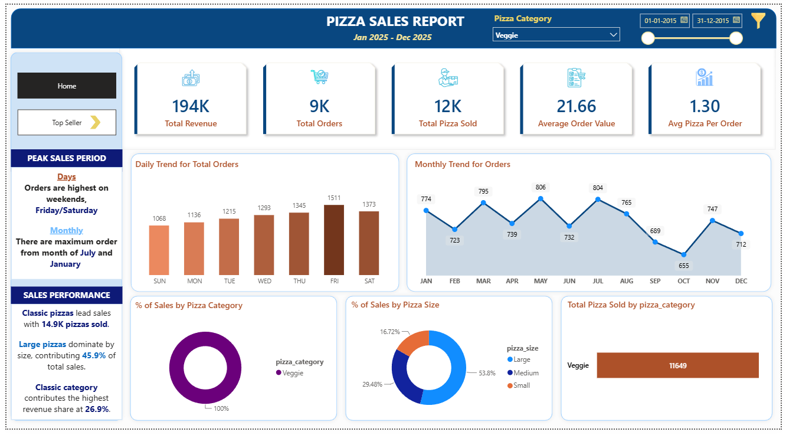
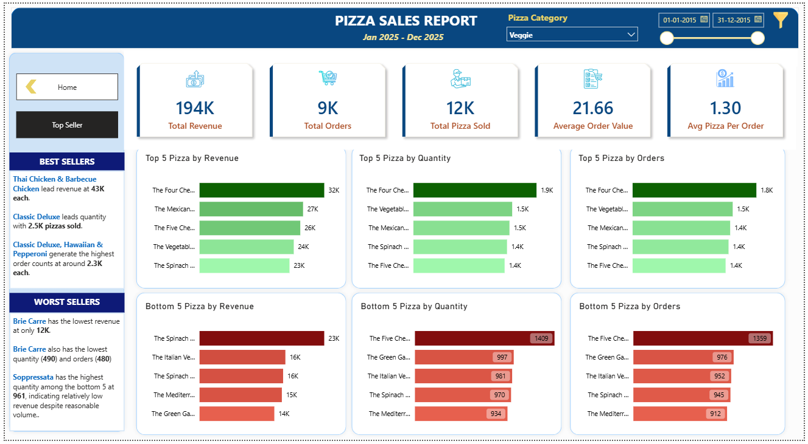

# Pizza Sales Data Analysis | SQL & Power BI

## Project Overview

This is an independent Data Analytics and Business Intelligence project focused on analyzing pizza sales data using **SQL Server and Power BI**.

The project demonstrates an end-to-end data analysis workflow, from data preparation and SQL analysis to KPI development, dashboard creation, and business insights.

> **Project Type:** Independent Data Analytics Project  
> **Dataset:** Generic Pizza Sales Dataset  
> **Time Period:** Historical data from approximately 10 years ago

---

## Objectives

The main objectives of this project are to:

- Analyze overall pizza sales performance.
- Calculate key sales KPIs.
- Identify daily and monthly order trends.
- Analyze sales by pizza category and size.
- Identify top and bottom-performing pizzas.
- Build an interactive Power BI dashboard.
- Generate business insights and recommendations from the analysis.

---

## Tools & Technologies

- **MS SQL Server**
- **SQL**
- **Power Query**
- **DAX**
- **Microsoft Power BI**
- **GitHub**

---

## Key KPIs

The dashboard focuses on the following key performance indicators:

- **Total Revenue**
- **Total Orders**
- **Total Pizzas Sold**
- **Average Order Value**
- **Average Pizzas Per Order**

---

## SQL Analysis

SQL Server was used to perform the main data analysis, including:

- KPI calculations
- Daily order analysis
- Monthly order analysis
- Revenue by pizza category
- Revenue by pizza size
- Total pizzas sold by category
- Top 5 pizzas by revenue
- Bottom 5 pizzas by revenue
- Top 5 pizzas by quantity
- Bottom 5 pizzas by quantity
- Top 5 pizzas by number of orders
- Bottom 5 pizzas by number of orders

---

## Power BI Dashboard

The Power BI dashboard provides an interactive view of pizza sales performance.

### Dashboard Analysis Includes:

- Overall sales KPIs
- Daily order trends
- Monthly order trends
- Revenue by pizza category
- Revenue by pizza size
- Top-performing pizzas
- Bottom-performing pizzas
- Interactive filters

---

## Project Files

### SQL Analysis
[View SQL Analysis](Pizza_Sales_Analysis.sql)

### Power BI Dashboard
[View Power BI Dashboard](Pizza_Sales_Dashboard.pbix)

### Project Documentation
[View Project Documentation](Pizza_Sales_Project_Documentation.pdf)

## 📷 Dashboard Preview

### Sales Dashboard



### Top & Bottom Performing Products



---

## Business Insights

The analysis helps identify:

- High- and low-demand periods.
- Best- and worst-performing products.
- Revenue contribution by pizza category.
- Customer preferences by pizza size.
- Products that have a significant contribution to overall sales.

These insights can support decisions related to **inventory planning, staffing, promotions, and menu optimization**.

---

## Project Limitations

This project uses a **generic pizza sales dataset** for independent data analytics and portfolio demonstration purposes. It is not based on the actual sales data of any specific company or organization.

The dataset represents a **historical period approximately 10 years ago**, so the identified patterns may not reflect current customer behaviour, pricing, market conditions, or industry trends.

Therefore, the findings are intended to demonstrate **data analysis and business intelligence skills** rather than represent current or company-specific business performance.

---

## Repository Structure

```text
pizza-sales-data-analysis/
│
├── README.md
│
├── SQL/
│   └── Pizza_Sales_Analysis.sql
│
├── PowerBI/
│   └── Pizza_Sales_Dashboard.pbix
│
├── Screenshots/
│   ├── pizza-sales-dashboard-overview.png
│   └── pizza-sales-dashboard-top-sellers.png
│
└── Documentation/
    └── Pizza_Sales_Project_Documentation.docx
